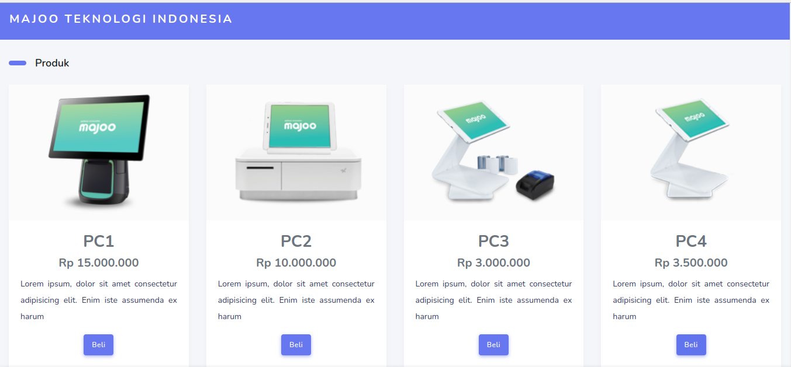
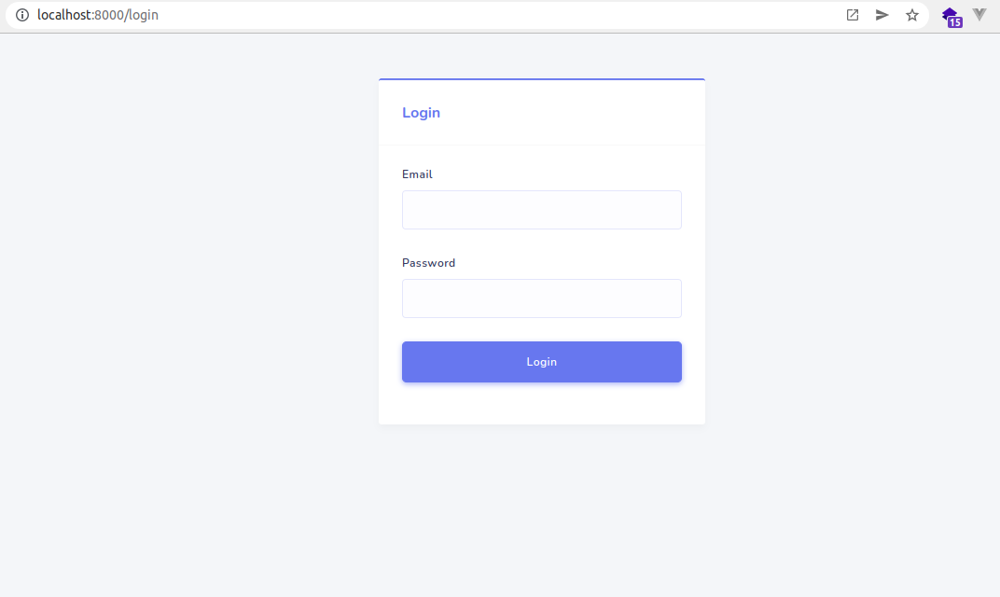
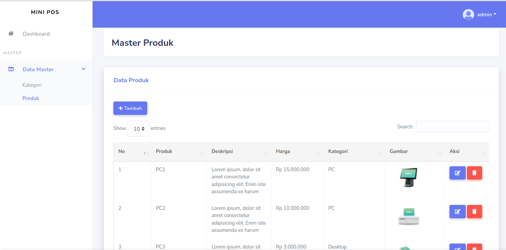

# Mini POS
Mini POS dengan Laravel 8.x 
#### Spesifikasi minimum server
1. PHP >= 7.3 (dan memenuhi [server requirement Laravel 8.x](https://laravel.com/docs/8.x/deployment#server-requirements)),

#### Tahap Install
1. Clone Repo, pada terminal : `git clone https://github.com/slametriky/mini-pos.git`
2. `$ cd mini-pos`
3. `$ composer install`
4. `$ cp .env.example .env`
5. Sesuaikan pengaturan database di file .env 
5. `$ php artisan key:generate`
5. `$ php artisan migrate`
6. `$ php artisan serve`

<h3>DB Seeder</h3>

Untuk membuat akun admin silahkan lakukan perintah berikut di cmd/terminal

    php artisan db:seed

#### Cara Akses
<h3>Homepage</h3>

    http://localhost:8000

<h3>Login</h3>
Untuk login gunakan akun berikut:

    username : admin@gmail.com
    password : admin123
    url      : http://localhost:8000/login

<h3>Master Kategori</h3>
CRUD Master Kategori

<h3>Master Produk</h3>
CRUD Master Produk

